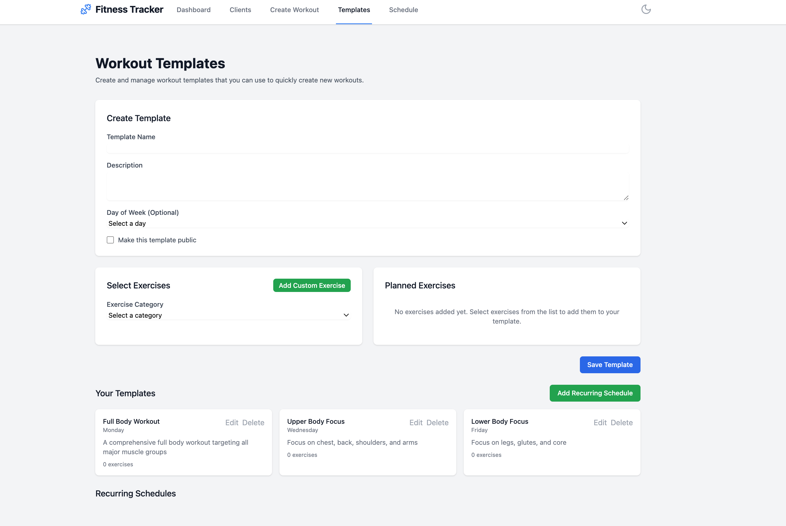

# Fitness Template Builder

A modern web application for personal trainers to manage clients, create workout plans, and track progress. Built with React, TypeScript, and Tailwind CSS.

[Live Demo](https://fitness-template-builder.vercel.app/)

## Screenshots

### Dashboard

*Main dashboard showing client statistics and quick actions*

### Client Management

*Client list with contact information and goals*

### Workout Planning

*Create and manage personalized workout plans*

### Progress Tracking

*Track client progress with interactive charts*

### Templates

*Browse and manage workout templates*

### Schedule

*View and manage recurring workout schedules*

## Purpose

This application helps personal trainers:
- Manage client profiles and track their progress
- Create and schedule personalized workout plans
- Monitor exercise progress with interactive charts
- Track workout history and completion rates
- Generate recurring workout schedules
- Analyze client performance and attendance

## Tech Stack

- **Frontend Framework**: React 18 with TypeScript
- **Styling**: Tailwind CSS for responsive design
- **State Management**: Zustand for global state
- **Charts**: Chart.js for progress visualization
- **Icons**: Lucide React for modern icons
- **Date Handling**: date-fns for date manipulation
- **Deployment**: Vercel for hosting

## Getting Started

1. Clone the repository:
   ```bash
   git clone https://github.com/yourusername/fitness-template-builder.git
   ```

2. Install dependencies:
   ```bash
   cd fitness-template-builder
   npm install
   ```

3. Start the development server:
   ```bash
   npm run dev
   ```

4. Open [http://localhost:5173](http://localhost:5173) in your browser.

## Features

### Client Management
- Create and manage client profiles
- Track client goals and progress
- View client statistics and workout history

### Workout Planning
- Create personalized workout plans
- Schedule recurring workouts
- Add exercises with sets, reps, and weights
- Include notes and instructions

### Progress Tracking
- Interactive charts for exercise progress
- Weight and rep tracking over time
- Workout completion rate monitoring
- Client attendance tracking

### User Interface
- Modern, responsive design
- Dark mode support
- Interactive charts and graphs
- Intuitive navigation

## Project Structure

```
src/
├── components/     # Reusable UI components
├── pages/         # Page components
├── store/         # Zustand store definitions
├── types/         # TypeScript type definitions
└── utils/         # Utility functions
```

## Contributing

1. Fork the repository
2. Create your feature branch (`git checkout -b feature/amazing-feature`)
3. Commit your changes (`git commit -m 'Add some amazing feature'`)
4. Push to the branch (`git push origin feature/amazing-feature`)
5. Open a Pull Request

## License

This project is licensed under the MIT License - see the [LICENSE](LICENSE) file for details.

## Recent Updates

- Added workout history with progress charts
- Implemented exercise progress tracking
- Enhanced UI with dark mode support
- Added recurring workout scheduling
- Improved client dashboard with statistics
- Added sample data for demonstration
